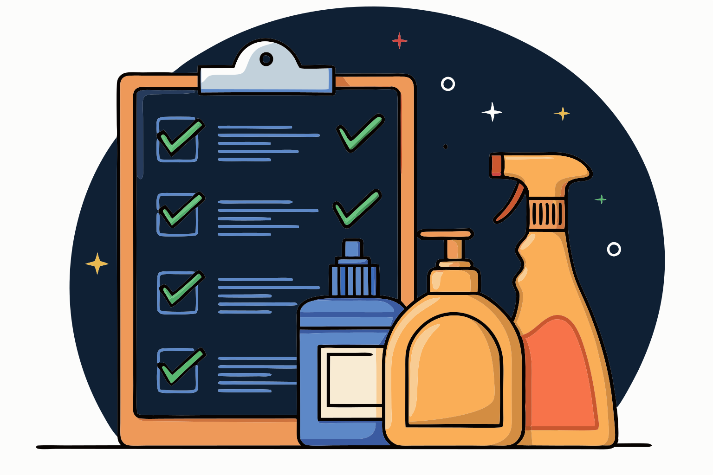

If you are yet not afraid of messy data, let us begin some **brief management horror stories**.

In 2015, **retail giant Target** faced one of its most significant failures when attempting to expand into Canada. A critical supply chain mismanagement issue led to the abrupt closure of 133 stores (source: [Talking Logistics](https://talkinglogistics.com/2014/05/28/big-crappy-data-problem-supply-chain-management/)). Just two years later, in 2017, **Uber**, a world-leading **on-demand cab service**, miscalculated driver payouts, resulting in an estimated USD 45 million in refunds (source: [Montecarlo Data](https://www.montecarlodata.com/blog-bad-data-quality-examples/)). That same year, **All Nippon Airways** suffered a costly currency conversion error, allowing customers to purchase tickets at up to a 95% discount, causing financial losses worth thousands of dollars (source: [Bloomberg](https://www.bloomberg.com/news/articles/2023-04-19/airline-blunder-sells-10-000-asia-us-business-class-tickets-for-300?sref=sBMxP0gT&leadSource=uverify%20wall)).

What do these incidents have in common? **Bad data**.

These examples illustrate how **poor data management** can have costly consequences for businesses. Imagine an online retailer shipping orders to incorrect addresses due to duplicate customer records or a bank approving loans based on outdated credit scores. These aren’t minor setbacks \- they lead to **financial losses, wasted resources, and damaged customer trust**.

**Clean data** \- accurate, complete, and properly formatted \- is the **foundation of smooth business operations**. And if you want to know more about it, this article is what you are looking for.

## 1\. Clean data: definition

High-quality data enables businesses to make informed decisions with confidence. But what exactly constitutes clean data?

Five fundamental elements can be seen as the **data quality**, which the [Data Management Association](https://www.dama.org/cpages/body-of-knowledge) defines as “the degree to which data is accurate, complete, reliable, and relevant to the purpose for which it is used”. As early as 1996, Thomas C. Redman [defined](https://books.google.rs/books/about/Data_Quality_for_the_Information_Age.html?id=UExPAAAAMAAJ&redir_esc=y) **clean data** as:

* **Accurate**: correct and error-free
* **Complete**: avoiding missing and incomplete information
* **Consistent**: being homogeneous across all business systems
* **Valid**: conform to predefined formats and rules
* **Updated**: keeping up with time and being ready to use when needed

A decade later, in 2016, Redman estimated in the [Harvard Business Review](https://hbr.org/2016/09/bad-data-costs-the-u-s-3-trillion-per-year) that bad data was costing businesses a **staggering USD 3 trillion annually**, a clear indicator that high-quality data isn’t just an IT issue \- it’s a strategic business decision that impacts every level of an organization.

## 2\. The twofold benefit of clean data

Clean data offers **two key advantages for businesses**:

* Improved **operational efficiency**
* Enhanced customer experience

In fact, by minimizing errors, reducing redundancies, and streamlining processes, clean data **supports smoother workflows and better decision-making**. Simultaneously, it helps create more personalized and reliable interactions with customers, fostering **long-term loyalty and engagement**.

Let’s delve into it a bit deeper.

**Operational efficiency** is another key advantage. Clean data minimizes redundancies, reduces processing errors, and ensures seamless workflows. As highlighted in our [Global Data Solutions](https://datahub.io/blog/global-data-solutions-curated-datasets-for-informed-business-decisions) article, **69% of practitioners report bad data directly harming their activities** ([PR Newswire](https://www.prnewswire.com/news-releases/great-expectations-study-reveals-77-of-organizations-have-data-quality-issues-301569359.html)). For logistic-based businesses in particular, a [Loquate report](https://www.loqate.com/it/) found that “address inaccuracies **derail a staggering 80% of deliveries**, causing costly delays (41%) and tout-court failures (39%)” ([DataHub.io](https://datahub.io/blog/one-database-every-postal-code-worldwide-simplify-your-search)).

Beyond analytics, clean data enhances **customer experience**. Duplicate records, incorrect addresses, or outdated contact details lead to frustration and lost revenue. According to [Salesforce](https://www.salesforce.com/blog/data-quality/), **94% of businesses believe that maintaining clean data improves customer engagement**. Organizations that prioritize accurate customer databases reduce churn, streamline personalized marketing efforts, and foster long-term loyalty.

As shown by the experiences of businessmen and experts, ensuring data quality is **not just a technical necessity but a strategic imperative**. And, given so, there is no wonder why [**data are the new gold**](https://datahub.io/blog/global-data-solutions-curated-datasets-for-informed-business-decisions).

## 3\. How to ensure clean data

Maintaining clean data requires the implementation of effective validation techniques. But what are the **specific practices** to perform the task?

* **Data Validation**: Implement rules like format checks, range constraints, and consistency checks at the point of entry to catch errors early
* **Regular Audits**: Conduct periodic data reviews to identify inconsistencies, outdated information, and redundancies that could impact business decisions
* **Deduplication**: Merge duplicate records to maintain a single, accurate representation of each entity and prevent inefficiencies
* **Standardization**: Use uniform data formats, naming conventions, and entry protocols to ensure consistency across all systems
* **AI-Powered Cleansing**: Leverage machine learning algorithms to detect patterns, correct errors, and maintain data accuracy over time

Among these practices, **data validation** and **AI-powered cleansing** are the most common and efficient. However, these methods work best when combined, particularly under the **guidance of a specialized professional team**.

Why? Because, by integrating these best practices, organizations can enhance data quality, improve analytics, and build a strong foundation for **business growth**.

## 4\. Keep your data clean with DataHub.io

In today’s data-driven world, maintaining **clean, structured, and reliable data** is crucial for business success. Open data platforms like [DataHub.io](http://DataHub.io) offer robust solutions to streamline data management, ensuring businesses have access to **accurate and well-organized datasets**.

DataHub.io provides a secure, structured environment for **storing, accessing, and [sharing](https://datahub.io/publish) datasets** while preserving data integrity. Its tailored [**solutions**](https://datahub.io/solutions) include seamless data validation, automated quality checks, and robust version control. With a dedicated team of professional data engineers, we are proud to offer expert oversight to **prevent inconsistencies and optimize decision-making processes**.

Clean data isn’t just an operational necessity \- it’s a key driver of business success, influencing **performance, compliance, and customer trust**. Because [DataHub.io](http://DataHub.io) knows that, to thrive in an increasingly data-centric landscape, **businesses must make data integrity a top priority**.

Make clean data a core part of your strategy today to drive innovation, enhance reliability, and ensure a future built on strong, accurate data.

🔎And if you want to discover more examples of bad data, [**check out our funder’s project**](https://datahub.io/@rufuspollock/bad-data)\!

| Want data that sparks ideas and fuels your work?📩Subscribe to our Weekly Dataset Pick and never miss a discovery\! 👉 [Subscribe now](https://datahub.io/#newsletter-form) – It’s free and built for curious minds. 🚀 |
| :---- |
