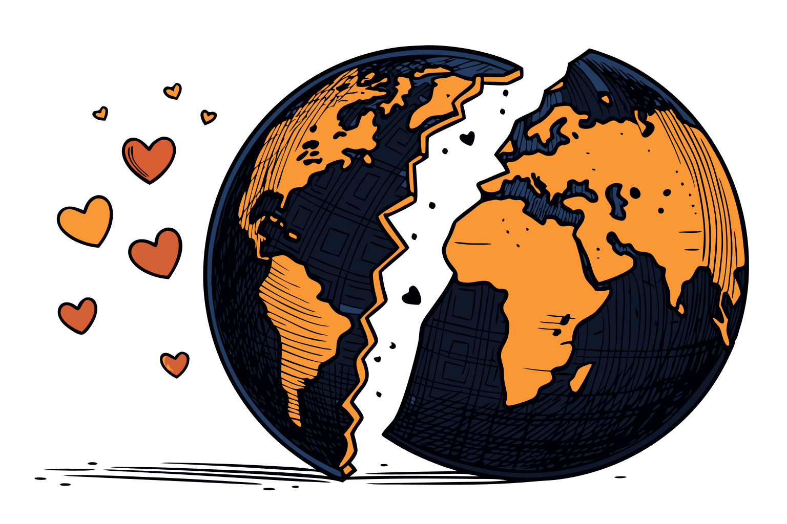
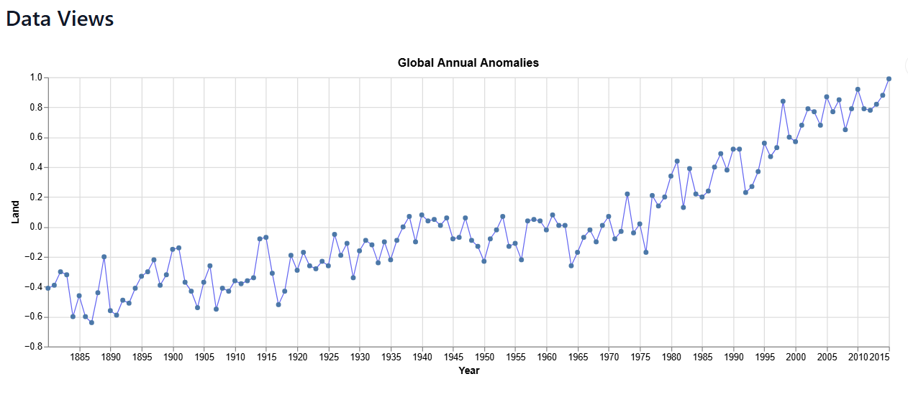
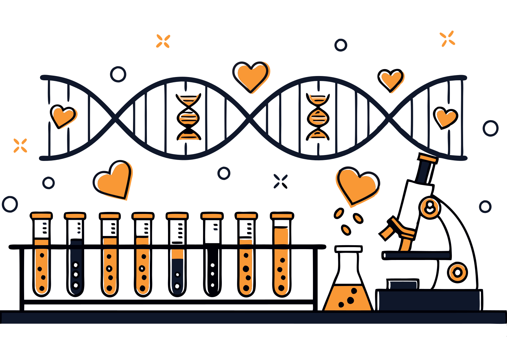

As we reach the grand finale of [**Love Data Week 2025**](https://datahub.io/blog/love-data-week-2025-a-global-celebration-of-data-impact), we want to pay tribute to some of the **datasets that have truly changed history**. They might not all be widely recognized, but their impact is undeniable, as they are helping us to understand our world and to shape our future.

Just like people, **datasets have personalities**. They speak to us in different ways and, when embraced, can transform the way we live, work, and connect. Open source data alone have the potential to **unlock $3 trillion annually in economic value**, [McKinsey Global Institute](https://www.mckinsey.com/capabilities/mckinsey-digital/our-insights/open-data-unlocking-innovation-and-performance-with-liquid-information) estimates.

So how can we truly appreciate their value? Just like a life partner, **structured data can challenge us, support us, and guide us toward better decisions** \- whether for personal growth, stronger communities, or smarter business strategies.

Let’s dive into three datasets that have, in their own way, shaped the world as we know it today.

## 1\. Tough Love: Temperature Anomalies & climate change data

Sometimes, love means telling hard truths. [Climate Change Data](https://datahub.io/collections/climate-change) has been doing just that for over a century, pushing us to **acknowledge inconvenient realities**. Their relationship with humanity, however, is not as young as one could believe.

As early as **1896**, scientist **Svante Arrhenius** identified the link between CO2 emissions and rising global temperatures. But by the **1950s and 60s**, despite growing climate debates, **limited access to reliable data** allowed skepticism and misinformation to flourish. Environmental protection quickly became a **battleground rather than a shared responsibility**.

Then came a turning point: in 1967, the world’s first accurate computer model of Earth’s climate (source: [UK Research and Innovation](https://www.discover.ukri.org/a-brief-history-of-climate-change-discoveries/index.html)) laid the foundation for **more precise climate tracking**. Today, [**open-source datasets**](https://datahub.io/collections/climate-change) cut through the noise, giving individuals and businesses **direct access to facts**, so we can form opinions based on data, and overcome a tribe-like approach to the matter.

A staggering example comes from a simple visualization of the [**globally recorded temperature anomalies**](https://datahub.io/core/global-temp-anomalies) from 1880 to 2015\. The graph does not leave space for interpretation about the **steer fact of climate change** but allows us to address it from innovative and beneficial angles.

The lesson? **Facts, not gut instincts, should shape our understanding.** And with accessible [climate data](https://datahub.io/collections/climate-change), we can **act, not just react**.

**❤️‍🔥Want to start exploring?** Start by checking out our [temperature anomalies dataset](https://datahub.io/core/global-temp-anomalies)

## 2\. A Love Letter to Humanity: DNA Sequencing data

Some datasets don’t just inform us—they revolutionize entire fields and touch lives directly. [**DNA sequencing** techniques](https://datahub.io/blog/the-evolution-of-dna-sequencing-costs-insights-from-2001-to-2022) are **some of the greatest love letters** data has ever written to humanity.

The **early days of DNA sequencing** were marked by high costs and limited accessibility. Back in 2001, the sequencing of a single human genome required **USD 95 million**, making this technology an exclusive prerogative of large-scale projects.

In 2022, the National Human Genome Research Institute published the "[first truly complete human genome sequence](https://www.genome.gov/about-genomics/telomere-to-telomere)", disclosing new unforeseen frontiers for medical advancement. Although individualized treatment is a [very antique practice](https://pmc.ncbi.nlm.nih.gov/articles/PMC7794000/), DNA sequencing’s love letter showed physicians new paths into **personalized medicine**. Revolutionizing **cancer treatments**, current genomic-based techniques would allow targeted therapies for 13% of patients with breast cancer (sources: [National Library of Medicine](https://pmc.ncbi.nlm.nih.gov/articles/PMC6719592/), [ASCO Publications](https://ascopubs.org/doi/10.1200/EDBK_175617)).

Not only so, but DNA modeling has also propelled advancements in **GMO technology and agriculture**, increasing food security and sustainability. Think of that: genetically modified crops have **lowered the use of pesticides by 37%** (source: [National Library of Medicine](https://pmc.ncbi.nlm.nih.gov/articles/PMC4218791/)), allowing agricultural businesses to drop costs and advance environment-friendly cultivation.

DNA sequencing’s love letter to humanity ends on a sweet note: **costs have dropped 99.9%, making a full human genome cheaper than a smartphone**. This dramatic decline echoes the ongoing democratization of data, empowering more individuals and organizations to fuel groundbreaking innovation.

Genomic-based techniques are revolutionizing healthcare, agriculture, and even the way we understand ourselves. But now is **your turn: how could genetic data impact your future**?

 🔬We have crafted a **more detailed article** about nowadays usages of DNA sequencing.
 Explore them now → [read the full article](https://datahub.io/blog/the-evolution-of-dna-sequencing-costs-insights-from-2001-to-2022)\!

## 3\. I Would Go Anywhere with You: Geodata

Some datasets are **constant and sound companions**, seamlessly guiding us through life. Think this type of partner could be your fix? **Geospatial data** is the one for you.

Mapping technology dates back centuries, but accuracy was historically limited. “Imago Mundi”, the first known world map, was created by the Babylonians **over 2,500 years ago** \- and was far from precise. Since then, human knowledge of the globe has evolved both in **precision and granularity**, making [**geodata**](https://datahub.io/solutions) the absolute protagonists of our everyday lives.

As technology evolved, so did our need for more than just static maps. **The global geospatial analytics market is projected to reach USD 85.77 billion by 2030** (source: [Grand View Research](https://www.grandviewresearch.com/industry-analysis/geospatial-analytics-market)), driven by applications ranging from **real-time traffic management** to [**precision agriculture**](https://www.safegraph.com/guides/geospatial-data-analytics), where satellite data helps optimize crop yields.

In today’s fast-paced world, where instant responses to geolocation issues are crucial, many companies still struggle with data quality. [**PR Newswire**](https://www.prnewswire.com/news-releases/great-expectations-study-reveals-77-of-organizations-have-data-quality-issues-301569359.html) reports that **77% of practitioners** face data quality challenges, with **90% saying** it significantly impacts efficiency. [**McKinsey**](https://www.mckinsey.com/industries/technology-media-and-telecommunications/our-insights/the-social-economy) adds that employees **waste 1.8 hours daily** searching for information, draining valuable business resources.

Having access to reliable and always-updated [**Global Data**](https://datahub.io/solutions) is nowadays crucial to maximize profits and efficiency. **Geospatial data doesn’t just help us move, it keeps the world going.**

📍 Need precise location insights? Discover how [**DataHub.io’s solutions**](https://datahub.io/solutions) can help you navigate your next big move with **data-driven precision.**

## Love Data and It Will Love You Back

These datasets \- and countless others \- remind us that **data isn’t just numbers**. It’s insight, innovation, and, sometimes, even tough love. It is not a coincidence that we also wanted to introduce you to [**5 data collections you could fall in love with**](https://datahub.io/blog/love-data-week-2025-a-global-celebration-of-data-impact).

As [DataHub.io](http://DataHub.io) wanted to introduce you to three **datasets that have changed human history**, we also want to encourage you to find the data that will make **your world spin around**.

🔎 Our [open-source collections](https://datahub.io/collections) might be cherishing exactly what you are looking for.
Start exploring, analyzing, and making informed decisions that shape the future. Because **in the right hands, data is not just information \- it’s transformation**.

| Want data that sparks ideas and fuels your work? 📩 Subscribe to our Weekly Dataset Pick and never miss a discovery\! 👉 [Subscribe now](https://datahub.io/#newsletter-form) – It’s free and built for curious minds. 🚀 |
| :---- |
