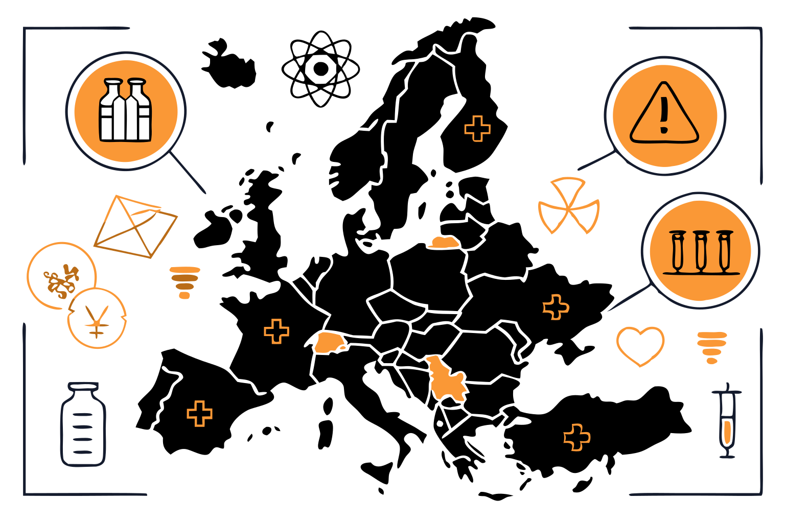

In healthcare, **data drives impact**. Yet, for decades, **pharmaceutical spending** has been a **black box** \- a critical but often misunderstood component of healthcare economics. Governments allocate billions. Investors bet on trends. Patients bear the costs. Yet, the **big picture remains elusive**.

What if we could finally see the full picture?

At **DataHub.io**, we believe **better data leads to better outcomes**. That’s why we built a [dataset](https://datahub.io/core/pharmaceutical-drug-spending) that doesn’t just summarize spending trends \- it **illuminates** them. Sourced from the **OECD**, this dataset tracks **50 countries over five decades**, providing a **comprehensive, structured, and reliable** view of global pharmaceutical expenditures.

If you're looking for **actionable insights** \- whether to guide policy, optimize investments, or drive innovation \- this dataset could be for you.

## 1. The dataset identikit

We have already mentioned it: the dataset on [Pharmaceutical Drug Spending per country](https://datahub.io/core/pharmaceutical-drug-spending) covers 50 countries over the 1970-2022 time window. More importantly, it includes **complete data** for the pharmaceutical expenditures of each state for the 2011-2021 decade.

The dataset is **overarching**, tacking spending from different points of view:

- Percentage of Health Spending (PC\_HEALTHXP)
- Percentage of GDP in Pharmaceutical spending (PC\_GDP)
- Spending per capita using economy-wide PPPs (USD\_CAP)
- Total spending in millions (TOTAL\_SPEND)

Through this variety of information, DataHub allows for a **multilayered analysis** of the pharmaceutical-state relationships over time.

## 2. Understanding Pharmaceutical Drug Spending by Country

In the world of healthcare economics, reliable data isn’t just important \- it’s essential. Yet, too often, a great share of the available information on health-related issues is fragmented, inconsistent, fuzzy, and often relying on unreliable sources. Our [dataset](https://datahub.io/core/pharmaceutical-drug-spending), on the contrary, hinges on the **official data** published by the Organisation for Economic Cooperation and Development ([OECD](https://www.oecd.org/en/data/indicators/pharmaceutical-spending.html)), merging it with our repository about the [world population](https://datahub.io/core/population).

Our files, available in JSON and CSV format, solve the problem of fragmentary information with:

* **Compactness**, excluding any redundant information that may disturb a straightforward analysis;
* **Reliability**, having two clear and detectable sources;
* **Tidiness**, only showing complete rows and being totally free of missing values.

As a result, the dataset on pharmaceutical drug spending by country can be perfect both to conduct **preliminary explorations** about your variables of interest and to craft efficient **visualizations** for any communication purpose.

Not sure? Let’s see together some of the categories that can benefit from it\!

## 3. Who can benefit from the dataset?

The **clarity and structure** of the Pharmaceutical Drugs Spending by country make it **adaptable** for many different purposes:

* **Pharmaceutical companies’ management**: targeted analysis of the dataset offers a broad overview of which countries tend to invest more in pharmaceutical products, favoring informed decision-making.

  * Identify demand trends
  * Optimize global pricing strategies
  * Streamline distribution and supply chain planning

* **Private investors**: countries’ expenditures both *pro capita* and in absolute figures can help back the management of dropshipping investments.

  * Spot emerging markets
  * Identify potential markets for complementary products
  * Assess demand trends and consistency
  * Shape data-driven investment decisions

* **Public services**: with reliable, structured data, policymakers can evaluate healthcare spending efficiency, and design evidence-based policies.

  * Compare data across countries
  * Weigh up pharmaceutical expenditures over time
  * Evaluate policy effectiveness
  * Support budget allocation decisions

* **Academics and researchers:** the dataset is a strong backbone for quantitative designs and comparative research, allowing academics to conduct precise statistical modeling, econometric analysis, and cross-country comparisons to assess pharmaceutical spending patterns over time.

  * Linking trends in countries’ investments to political shifts at the national and international level
  * Compare healthcare investment across countries
  * Evaluate healthcare investment efficiency
  * Shape prediction models for future pharmaceutical spending behaviors

Highly versatile, the [Pharmaceutical Drug spending dataset](https://datahub.io/core/pharmaceutical-drug-spending) bridges gaps between diverse stakeholders in the pharmaceutical industry and the public sector. It makes healthcare-related information **actionable**, enabling data-driven decisions within international markets, social development, and research knowledge building.

## 4. A ready-to-use scheme

| Field                | Description                                                                                           |
|----------------------|-------------------------------------------------------------------------------------------------------|
| NAME                 | [Pharmaceutical Drug Spending by Country](https://datahub.io/core/pharmaceutical-drug-spending)      |
| FORMAT               | JSON, CSV                                                                                           |
| ROWS                 | 1788                                                                                                 |
| COLUMNS              | 7                                                                                                    |
| TYPES OF VARIABLES   | string, year, number                                                                                 |
| STATES               | 50                                                                                                   |
| YEARS                | 1970-2022                                                                                           |
| TYPE OF SPENDINGS    | Percentage of health spending, Percentage of GDP spending, Spending per capita, Total spending       |
| SOURCE               | OECD, DataHub                                                                                       |
| LICENSE              | Public Domain Dedication and License ([PDDL](https://opendatacommons.org/licenses/pddl/))           |

**Need a more specific insight regarding costs associated with genetic research?**

Check the National Human Genome Research Institute dataset about [Costs associated with DNA sequencing since 2001](https://datahub.io/core/genome-sequencing-costs)\!

📥 Get the Data & Start Exploring → [Download Now](https://datahub.io/core/pharmaceutical-drug-spending)