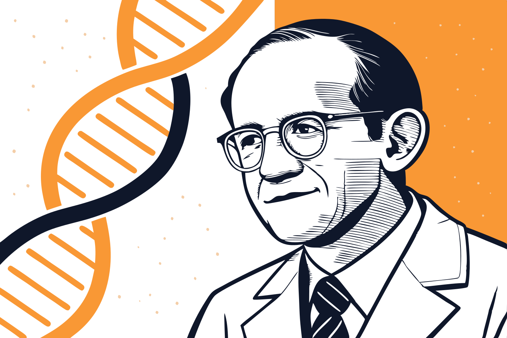
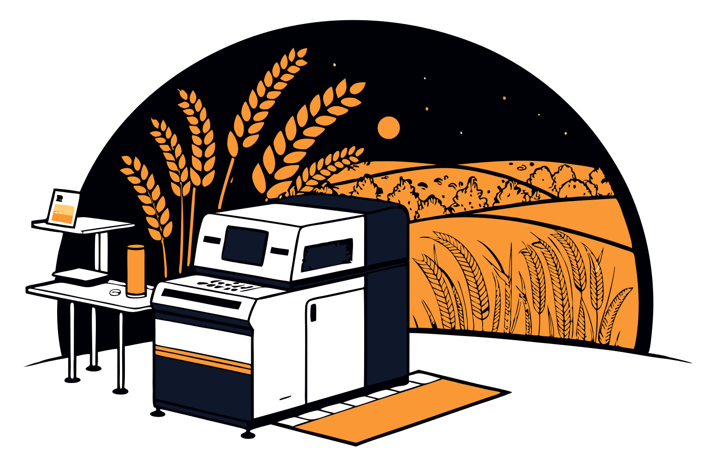

If someone had told you in 2001 that **sequencing an entire human genome would soon cost less than a smartphone**, you probably wouldn’t have believed them.

Back then, it cost **USD 95 million** to decode a single human genome. A feat so complex that only government-backed research initiatives could afford it. Today, that cost has fallen to **USD 200**, making genome sequencing as accessible as a routine medical test.

**This is one of the most stunning cost reductions in scientific history.**

DNA sequencing is no longer reserved for billion-dollar research institutions. It’s an **everyday tool for scientists, entrepreneurs, and even startups**. It’s shaping medicine, agriculture, environmental science, and forensics in ways that were unimaginable just two decades ago.

But cost drops don’t just happen. If you want to know more about their patterns to inform your decisions, this article can help you discover the latest opportunities offered by DNA sequencing.

## 1\. What is DNA Sequencing and Why Does it Matter?

DNA sequencing is the process of reading the genetic code that makes up every living organism. It provides an **instruction manual** of life, mapping the four chemical bases that define us: adenine (A), thymine (T), cytosine (C), and guanine (G), it provides an instruction manual for life.

**DNA determines everything**, from our species and physical traits, up to our susceptibility to specific diseases. By sequencing it, scientists can understand how organisms **function, evolve, and interact** with their environment.

Although **F. Miescher discovered DNA in 1869**, sequencing technology emerged almost a **century later**, pioneered by F. **Sanger** and F. **Crick**. Their breakthroughs laid the foundation for genomic-based research, turning DNA sequencing from a theoretical concept into a powerful tool for medicine, agriculture, and research.

### How is DNA Sequencing Used Today?

Current applications of DNA sequencing encompass vast areas, meeting the necessities of very different professionals:

* Enabling a deeper understanding of **genetic disorders**;
* Tracing **evolutionary pathways**;
* Developing **targeted medical treatments**;
* Exploring genetic manipulation for **agricultural businesses** (help improve crop yields, develop pest-resistant plants, and reduce environmental impact);
* Conduct **forensic investigations** (solve crimes by identifying DNA at crime scenes);
* Inform **environmentalist** and **microbiological** research (track biodiversity, monitor disease outbreaks, and even study ancient DNA).

No wonder that Sanger was the only scientist to have been awarded with **two Nobel prizes**\!

## 2\. State-of-the-art: where are we now?

As scientists and researchers know, the **numbers associated with DNA sequencing** can be huge, especially in complex organisms. Consider that the **complete human DNA** comprises 6,4 billion couple bases. This can also be expressed as 6,400 megabases.

The challenge? **Mapping this massive amount of data.** For years, it was like trying to reconstruct an ancient manuscript with missing pages, and gaps in knowledge that obscured vital insights.

No worries: the scientific community has done a great job in tackling this **huge amount of data**. By the end of 2022, the National Human Genome Research Institute published the “[**first truly complete human genome sequence**](https://www.genome.gov/about-genomics/telomere-to-telomere)”, including all of the 99.9% megabases we all share as human beings.

However, much has still to be done.

## The Final 0.1%: The Frontier of Genomics

Within the remaining **0.1% of the human genome** lies the deepest mysteries of individuality \- genetic variations that determine everything from why some people are resistant to diseases to the genetic factors influencing intelligence and longevity.

Unlocking this last fraction is more than a technical challenge \- it is the key to **truly personalized medicine, advanced gene therapies, and even our understanding of human evolution**.

Furthermore, most of life on Earth remains genetically unexplored. Thousands of species have yet to be sequenced, offering untapped opportunities in medicine, sustainability, and biotechnology.

## 3\. The staggering decrease in costs associated with DNA sequencing

We already mentioned it several times: technological advancements lead to a **drastic cut in costs associated with DNA sequencing**. To what extent?

The [NHGRI dataset](https://datahub.io/core/genome-sequencing-costs) uncovers impressive figures. The medium cost to sequence a human genome was over **USD 95 million in 2001**. By 2022, that cost dropped to **USD 525** a staggering decrease of 99.99%. Just one year later, the [Illumina Center](https://emea.illumina.com/techniques/sequencing/dna-sequencing.html) reached the **USD 200** threshold.

## **Who can benefit from the cost drop?**

The exponential **99.99% decline in dollars** to sequence a human genome mirrors a well-known economic principle \- a combination of Moore’s Law and economies of scale.

But it is not just about cost savings. It’s about **what becomes possible** when price is no longer a barrier.

* In **healthcare**, genome sequencing unlocks personalized medicine, gene therapies, and early disease detection;
* In **agriculture**, farmers are using genetic data to grow crops that resist climate change
* In **startups & biotech**, small teams can now launch genome-driven businesses without billion-dollar budgets;
* In the **academy**, virologists, biologists, and environmental researchers can access DNA sequencing even for low-budget projects.

## 4\. The dataset features

Notwithstanding the relative cheapness of DNA sequencing nowadays, scientists and businessmen would still want to draw **exact predictions** about how much the implementation of their project may cost. That’s why the [NHGRI dataset](https://datahub.io/core/genome-sequencing-costs) includes figures about both:

* Costs for sequencing a **single megabase**;
* Costs for sequencing a **whole human genome**.

Let’s delve into it a bit more.

As already mentioned, the [dataset](https://datahub.io/core/genome-sequencing-costs) provided by the NHGRI tracks trends in DNA sequencing costs within their facilities over two decades (2001-2022). To add on, the dataset includes **several cost measurements for each year**, offering specific insights into the evolution of sequencing technologies.

Overall, the [**NGHRI dataset**](https://datahub.io/core/genome-sequencing-costs) is:

* **Highly specific**, including several cost measurements for each addressed year;
* **Concise,** allowing easy analysis and preliminary insights on the past trends and future developments in DNA sequencing;
* **Usable**, avoiding useless variables and strictly focusing on cost trends over the years.

Most significantly, this open source is a great showcase not only of NHGRI’s services but also of the evolution of **DNA sequencing** as a main subject across various research fields.

## 5\. Who can benefit from DNA sequencing costs data

It should be clear, by now, that the **six implementation areas** that we briefly mentioned before represent just a tiny part of the opportunities that DNA sequencing offers. However, having a preview of its costs advantages any professionals who are planning a broader project, be it for **academic**, **societal**, or **business purposes**.

* **Health professionals** can budget the improvement of their facility’s services, eventually becoming recognized for excellence in treating specific diseases:
  * CAR-T therapies for individual patients;
  * Prevention of breast cancer and Alzheimer’s disease;
  * Gene therapy and gene replacement approaches;
  * Targeted treatments for specific oncological cases.

* **Agricultural investors** can leverage this dataset to explore new investment opportunities, to improve their production by:
  * Enhance crop resilience;
  * Optimize soil health;
  * Reduce dependency on chemical fertilizers and pesticides.

* **Virologists** can conduct research both for academic and pharmaceutical-business purposes:
  * Conduct genomic surveillance;
  * Develop new vaccines and antiviral drugs;
  * Identify drug-resistant strains of viruses.

* **Environmentalists**:
  * Monitor biodiversity through eDNA sequencing;
  * Track invasive species and pathogens;
  * Analyze microbial communities to foster bioremediation;
  * Study genetic adaptations of species.

* **Scientific populizers and influencers** can use the [NHGRI dataset](https://datahub.io/core/genome-sequencing-costs) to have reliable data on the costs associated with DNA sequencing to:
  * Draft dedicated content;
  * Comparing the NHGRI figures with other facilities;
  * Suggesting possible the costs’ collapse.

## 6\. The dataset recap table

| NAME | [Costs associated with DNA sequencing](https://datahub.io/core/genome-sequencing-costs) |
| :---- | :---- |
| FORMAT | CSV, JSON |
| ROWS | 78 |
| COLUMNS | 3 |
| TYPES OF VARIABLES | date, number |
| TYPES OF COSTS | Cost per megabase (Mb) in USD Cost for a whole human genome in USD |
| YEARS | 2001-2022 |
| SOURCE | [NHGRI](https://www.genome.gov/) |
| LICENSE | Public Domain Dedication and License v1.0 ([ODC-PDDL-1.0](http://www.opendatacommons.org/licenses/pddl/1.0/)) |

## 7\. What’s Next?

Imagine a world where DNA sequencing is practically free.

Today, genome sequencing is as cheap as a few Uber rides. Tomorrow, it will be so cheap it will become a **standard medical test**. What happens when everyone’s DNA is sequenced at birth?

This dataset won’t just tell you where we’ve been \- it will help you see where we’re going.

📥 Get the Data & Start Exploring → [**Download Now**](https://datahub.io/core/genome-sequencing-costs)

& if you also need information about **state spending on pharmaceutical drugs**, see the OECD dataset on [Pharmaceutical drug spending by countries](https://datahub.io/core/pharmaceutical-drug-spending)\!

| Want data that sparks ideas and fuels your work?📩 Subscribe to our Weekly Dataset Pick and never miss a discovery\! 👉 [Subscribe now](https://datahub.io/#newsletter-form) – It’s free and built for curious minds. 🚀 |
| :---- |
